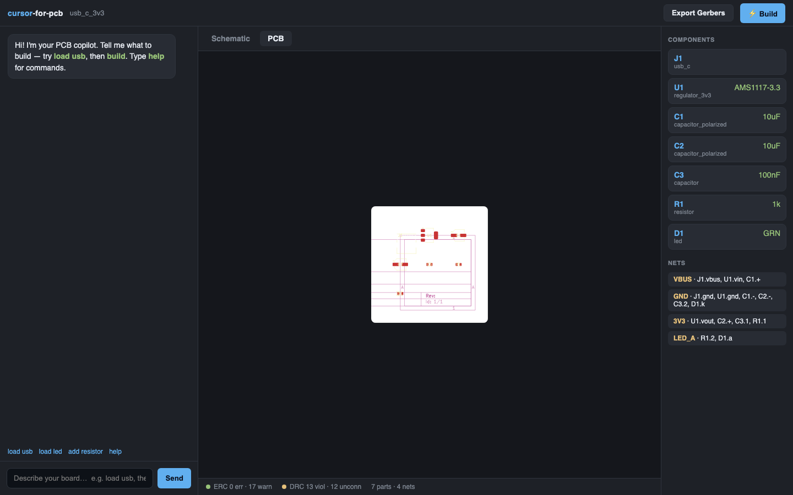
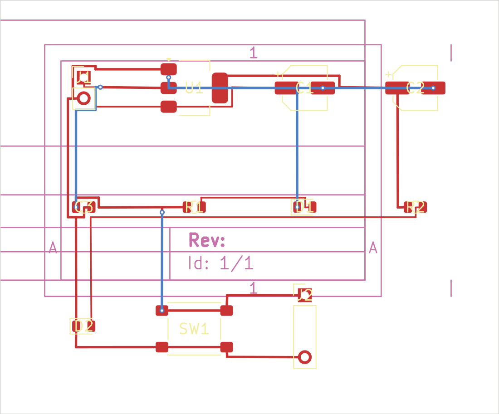

# cursor-for-pcb

**An AI-native PCB design tool.** Chat your way to a real circuit — describe a
board in plain language and get a **schematic**, a **PCB layout**, a KiCad
**netlist**, ERC/DRC verdicts, and **Gerber** fab files. The whole engine is
also exposed as an **MCP server**, so [Claude Code](https://claude.com/claude-code)
(or any MCP client) can drive board design end-to-end.

> Think *Cursor*, but the canvas is a printed circuit board.



## Why an open-source core

The hard, irreducible part of EDA is the file formats, the part libraries, and
the design-rule checks. Rather than reinvent them, cursor-for-pcb stands on
**[KiCad](https://www.kicad.org/)** — the industry-standard open-source EDA
suite — plus two pure-Python libraries:

| Layer | Tool | Role |
|------|------|------|
| Circuit capture | **[SKiDL](https://github.com/devbisme/skidl)** | describe a circuit in Python → real KiCad **netlist** + **ERC** |
| Board authoring | **[kiutils](https://github.com/mvnmgrx/kiutils)** | read/write `.kicad_pcb` / `.kicad_sch` directly (no GUI needed) |
| Autorouting | **built-in** | 2-layer Lee/maze router emits real copper tracks + vias |
| Render / verify / fab | **`kicad-cli`** | PCB→SVG, **DRC**, **Gerber** + drill export |



*An autorouted 2-layer board — red = top copper, blue = bottom copper, vias where
traces change layer. Generated from chat, DRC-clean (no shorts/clearance).*

Because everything is plain text built on stock KiCad libraries, an LLM can
manipulate the design as **structured data and code** — the format LLMs are
best at — and every artifact opens cleanly in KiCad for a human to finish.

## Architecture

```
┌─────────────┐   chat / tools   ┌──────────────────────────────────────┐
│  Web UI     │ ───────────────► │  pcbforge engine                     │
│ (chat+tabs) │                  │                                      │
└─────────────┘                  │  Design (parts + nets)               │
┌─────────────┐   MCP (stdio)    │     │                                │
│ Claude Code │ ───────────────► │     ├─ SKiDL  → netlist (.net) + ERC │
└─────────────┘                  │     ├─ kiutils → board (.kicad_pcb)  │
                                 │     ├─ SVG renderer → schematic.svg  │
                                 │     └─ kicad-cli → pcb.svg, DRC, gbr │
                                 └──────────────────────────────────────┘
```

- **`engine/`** — `pcbforge`, the core Python package. A high-level `Design`
  (components + nets) compiles to all the KiCad artifacts.
- **`mcp-server/`** — `pcbforge-mcp`, an MCP server exposing the engine as 12
  tools so an AI agent can design boards.
- **`web/`** — a Flux-style two-pane web app (chat + Schematic/PCB tabs).

## Quickstart

Requires **KiCad 8/9/10** installed (for libraries + `kicad-cli`) and Python ≥ 3.10.

```bash
python3.12 -m venv .venv
.venv/bin/python -m pip install -e ./engine -e ./mcp-server "mcp[cli]" uvicorn cairosvg

# build an example board from the CLI (autorouted + DRC-clean)
.venv/bin/pcbforge list
.venv/bin/pcbforge build power_led_board -o out/power_led_board
#  -> out/power_led_board/{*.net, *.kicad_pcb, schematic.svg, pcb.svg, gerbers/}
```

### Web UI

```bash
.venv/bin/python web/serve.py        # http://127.0.0.1:8765
```
Type `load usb` then `build`, or go incremental:
`new myboard` → `add resistor 330` → `add led` → `connect vcc r1.1` → `build`.

**Real AI chat:** export an API key and Claude drives the engine via tool use —
describe a board in plain English and it adds parts, wires nets, and builds:
```bash
ANTHROPIC_API_KEY=sk-ant-... .venv/bin/python web/serve.py
# optional model override (default claude-opus-4-8):
PCBFORGE_LLM_MODEL=claude-haiku-4-5 ANTHROPIC_API_KEY=sk-ant-... .venv/bin/python web/serve.py
```

### MCP server (drive it from Claude Code)

```bash
claude mcp add pcbforge --scope user \
  --env PCBFORGE_WORKSPACE=$HOME/.pcbforge/workspace \
  -- $PWD/.venv/bin/pcbforge-mcp
```
Then just ask Claude Code: *“design a USB-C powered 3.3 V rail with a power
LED and build it.”* It will call `add_part` / `connect` / `build` and read back
the schematic, PCB, and DRC results.

**Tools:** `list_part_types`, `list_examples`, `new_design`, `load_example`,
`add_part`, `remove_part`, `connect`, `get_design`, `build`,
`get_schematic_svg`, `get_pcb_svg`, `export_gerbers`.

## Example: USB-C → 3.3 V regulator

```python
from pcbforge import Design, build_all

d = Design(name="usb_c_3v3")
d.add_component("usb_c", "J1")
d.add_component("regulator_3v3", "U1", "AMS1117-3.3")
d.add_component("capacitor_polarized", "C1", "10uF")
d.add_component("led", "D1", "GRN")
d.add_component("resistor", "R1", "1k")
d.connect("VBUS", "J1.vbus", "U1.vin", "C1.+")
d.connect("GND",  "J1.gnd", "U1.gnd", "C1.-", "D1.k")
d.connect("3V3",  "U1.vout", "R1.1")
d.connect("LED_A", "R1.2", "D1.a")

res = build_all(d, "out/usb_c_3v3", gerbers=True)
print(res.ok, res.erc_errors, res.drc_violations)
```

## Part catalog (v0.1)

Resistor · capacitor (ceramic & polarized) · LED · diode · push button ·
2/4-pin headers · **AMS1117-3.3 LDO** · **USB-C receptacle**. Each maps to a
stock KiCad symbol + footprint with friendly pin names (`U1.vin`, `D1.a`,
`C1.+`). Adding parts is a one-line entry in `engine/pcbforge/library.py`.

## Status & roadmap

**Working today:**
- chat/MCP-driven capture; **LLM-in-the-loop web chat** — set `ANTHROPIC_API_KEY`
  and Claude drives the engine via tool use (offline parser fallback otherwise)
- real KiCad netlist + ERC; **2-layer autorouting** (copper tracks + vias)
- **GND copper pour** (filled ground plane via KiCad's `pcbnew`) — auto-applied
  when it routes cleaner
- **connectivity-aware placement** + courtyard-aware spacing; `build_all` tries
  multiple placement/pour strategies and keeps the cleanest by DRC
- **multi-pad power pins** (USB-C VBUS/GND fan out to all pads)
- **28-part catalog** (passives, transistors, MOSFETs, diodes, crystal, ESP32,
  555, op-amp, regulators, USB-C/micro, headers, screw terminal…)
- schematic & PCB SVG, DRC, Gerber export, 4 example circuits, web UI, 8 tests

Boards without fine-pitch parts (e.g. `power_led_board`, 11 parts) autoroute
**100% connected, copper-DRC-clean, with a ground plane**. Remaining warnings
are cosmetic silk (reference text over pads).

**Known limitation:** very fine-pitch connectors (USB-C at 0.5 mm pitch) still
leave a few clearance/short warnings in the connector area — dedicated escape
(micro-)via fanout is hard for a gridded maze router and commercial routers
struggle here too. The board still routes fully *connected*; the warnings are
local to the connector.

**Next:** fine-pitch escape-via fanout · power pours beyond GND · constraints
from the prompt (board size, layer count) · streaming LLM chat with live board
updates per tool call.

## Tests

```bash
(cd engine && ../.venv/bin/python -m pytest -q)
```

## License

MIT — see [LICENSE](LICENSE). KiCad libraries are under their own licenses.
